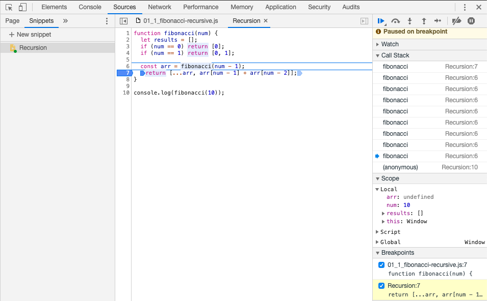
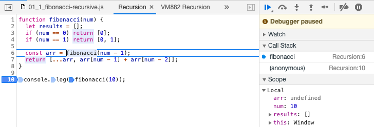
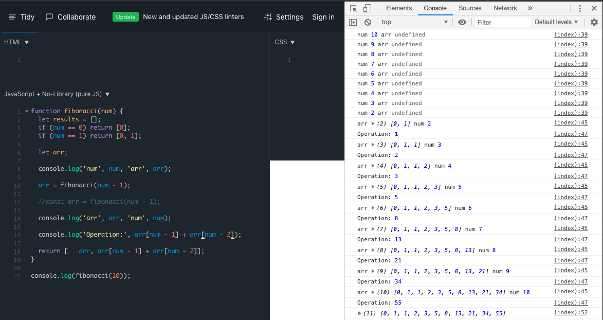

# Recursion

Colloquially, recursion is the process through which a `function calls itself until a base case is reached`.

Some common `test-questions`:

## Fibonacci

Output or log an array with the Fibonacci sequence until `num` (aka, index). More information about [Fibonacci Interview Question](./01_0_fibonacci.md)

### Solution: 

```javascript
function ç(num) {
  let results = [];
  if (num == 0) return [0];
  if (num == 1) return [0, 1];

  const arr = fibonacci(num - 1);
  return [...arr, arr[num - 1] + arr[num - 2]];
}

console.log(fibonacci(10));
```

Result:
```
[0, 1, 1, 2, 3, 5, 8, 13, 21, 34, 55]
```

Before addressing other examples, let's see `HOW recursion looks in our browser's DEV tools`. 

* Open the `Dev Tools`. 
* Click on `Sources`. 
* Check or select `Snippets`. 
* Create a `New Snippet` and paste the previous code (our `fibonacci()`).
* Then, `add a breakpoint` to the line `return [...arr, arr[num - 1] + arr[num - 2]];` and `run the snippet`.



Great! So, the first time, our `function` is invoked with `10` as argument. The namespace `result` is declared initializing it with an `empty array`. Then, both conditionals run and since their results are `false`, we hit the declaration of `arr` which is equals to the result of invoking our function with `9` (10 - 1) 



We can also add some `logs` to see what's going on in each iteration. 




## Factorial


### Solution: 

```

```

Result:
```

```