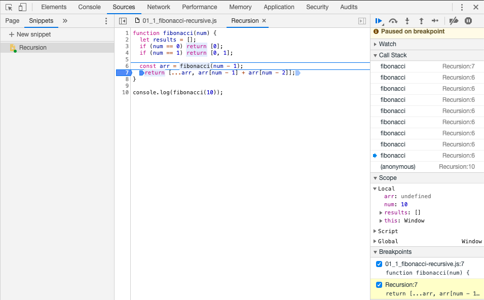
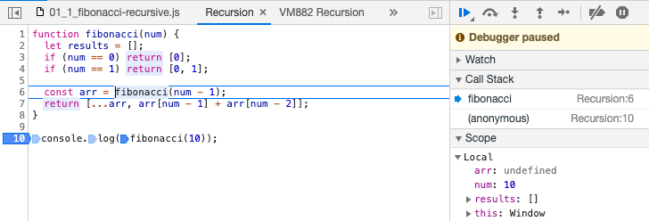
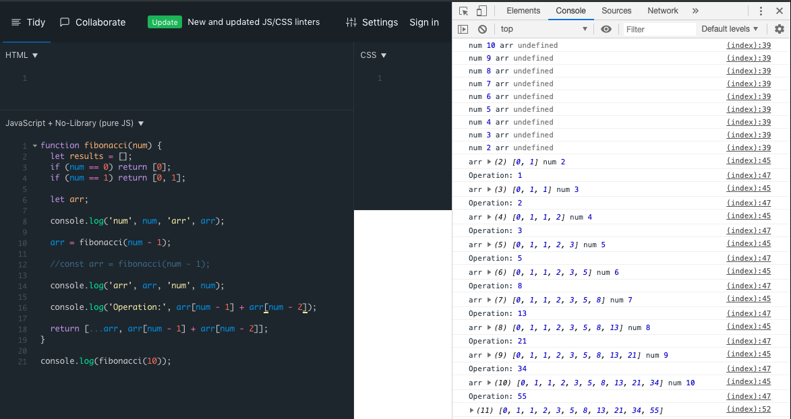

# Recursion

Colloquially, recursion is the process through which a `function calls itself until a base case is reached`.

Some common `test-questions`:

## Fibonacci

Output or log an array with the Fibonacci sequence until `num` (aka, index). More information about [Fibonacci Interview Question](./01_0_fibonacci.md)

### Solution: 

```javascript
function fibonacci(num) {
  if (num == 0) return [0];
  if (num == 1) return [0, 1];

  const arr = fibonacci(num - 1);
  return [...arr, arr[num - 1] + arr[num - 2]];
}

console.log(fibonacci(10));
```

Result:
```
[
   0, 1,  1,  2,  3,
   5, 8, 13, 21, 34,
  55
]
```

Before addressing other examples, let's see `HOW recursion looks in our browser's DEV tools`. 

* Open the `Dev Tools`. 
* Click on `Sources`. 
* Check or select `Snippets`. 
* Create a `New Snippet` and paste the previous code (our `fibonacci()`).
* Then, `add a breakpoint` to the line `return [...arr, arr[num - 1] + arr[num - 2]];` and `run the snippet`.



Great! So, the first time, our `function` is invoked with `10` as argument. The namespace `result` is declared initializing it with an `empty array`. Then, both conditionals run and since their results are `false`, we hit the declaration of `arr` which is equals to the result of invoking our function with `9` (10 - 1) 



We can also add some `logs` to see what's going on in each iteration. 




## Factorial

`n!` is every integer from 1 to n multiplied together, and it is the other question you get asked about
recursion, usually right after fibonacci. It is a better first example than fibonacci, because there is
exactly one recursive call and the base case is obvious.

### Solution:

```javascript
function factorial(num) {
  if (num < 0) return undefined;
  if (num <= 1) return 1;

  return num * factorial(num - 1);
}

console.log(factorial(5));
// 120
console.log(factorial(1), factorial(0));
// 1 1
console.log(factorial(-1));
// undefined
```

`factorial(0)` is 1 rather than 0, which is worth knowing because it is a definition rather than something the
code falls into by accident: the empty product is 1, the same reason an empty sum is 0.

Two things an interviewer may follow up with.

**Where it breaks.** Every call adds a frame, so a big enough `num` overflows the stack, and the numbers stop
being exact long before that: doubles hold integers exactly only up to 2^53 - 1, and `factorial(21)` is
already past it.

```javascript
console.log(Number.isSafeInteger(2 ** 53 - 1));
// true

function factorial(num) {
  if (num <= 1) return 1;
  return num * factorial(num - 1);
}

console.log(factorial(21));
// 51090942171709440000
console.log(Number.isSafeInteger(factorial(21)));
// false
```

That number is not wrong by a rounding error you can ignore, it is the nearest double to the real answer of
51,090,942,171,709,440,000. If exactness matters, use `BigInt`:

```javascript
function factorialBig(num) {
  if (num <= 1n) return 1n;
  return num * factorialBig(num - 1n);
}

console.log(factorialBig(21n));
// 51090942171709440000n
```

**The iterative version**, which is what to reach for when the recursion buys you nothing:

```javascript
function factorial(num) {
  let result = 1;
  for (let i = 2; i <= num; i++) result *= i;
  return result;
}

console.log(factorial(5));
// 120
```

One frame instead of n, and the same answer. Recursion is worth it when the SHAPE of the problem is recursive,
like walking a tree or the flattening on the
[multidimensional arrays](./07_0_multidimensional-arrays.md) page. A countdown is not that shape.