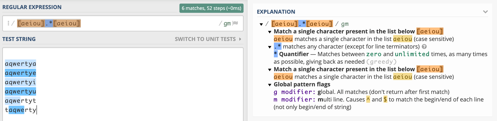
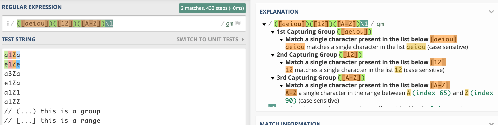

# 10 days of JavaScript 
These set is really basi;, however, I will include some examples, mostly, those that I can use as triggers to address other topics or `better design practices`.

## Day 1: Let and const

Define constants and output the `area` and `perimeter` values given `r` radius of a `circle`.

```javascript
// ...
  const PI = Math.PI;
  const  r = readLine();
  const area = PI * (r * r);
  const perimeter = 2 * PI * r;
  
  console.log(area)
    
  console.log(perimeter)
//...
```

High-level `Circle` intro: [What is a Circle...?](http://math2.org/math/geometry/circles.htm)

In a "real world case", probably, you will want to create a file where you define particular `functions` and import them as you need.

* Example with flag `--experimental-modules calculations` and `*.mjs`: [geometry](./geometry/README.md)

* Same example using `esm` package: [geometry](./geometry1/README.md)

---

## Day 2: Conditional Statements: Switch

This is an interesting but controversial case... `switch with non-fixed values or conditions` as a possible solution.

Please, don't get me wrong... `hackerrank` doesn't suggest to follow the subsequent approach; nonetheless, if you apply it you will not receive any linting complain and all test will pass.

Enough talk... Let's go to the code!

Take a look to [MDN web docs - Switch](https://developer.mozilla.org/en-US/docs/Web/JavaScript/Reference/Statements/switch) 

> The switch statement evaluates an expression, matching the expression's value to a case clause, and executes statements associated with that case, as well as statements in cases that follow the matching case.

Example:
```javascript
let expression = 'B'
let result

switch(expression) {
  case 'A':
    result = 'Is A'
    break;
  default:
    result = 'Not A'
}


console.log(result)
```

Output:
`Not A`

But... What happens if we want to execute "some amount of logic", setting, for example, the value of our expression to a boolean, `true`, and checking if one our cases logic results in true.

Example:
```javascript
const getLetter = (s) => {
  let letter;

  const group1 = ['a', 'e', 'i', 'o', 'u'];
  const group2 = ['b', 'c', 'd', 'f', 'g'];
  const group3 = ['h', 'j', 'k', 'l', 'm'];
  const group4 = ['n', 'p', 'q', 'r', 's', 't', 'v', 'w', 'x', 'y', 'z'];

  switch (true) {
    case (group1.indexOf(s) !== -1):
      letter = 'A';
      break;
    case (group2.indexOf(s) !== -1):
      letter = 'B';
      break;
    case (group3.indexOf(s) !== -1):
      letter = 'C';
      break;
    case (group4.indexOf(s) !== -1):
      letter = 'D';
      break;
    default:
      letter = 'Bug'
  }
  return letter;
}

console.log(getLetter('f'))
console.log(getLetter('a'))
console.log(getLetter('x'))
console.log(getLetter('aa'))
```

Output:
```
B
A
D
Bug
```
Most people will recommend you to use `if/else statements` instead, and avoid some buggy scenarios... And I'm among them! You are warned! 

---

## Day 5: Inheritance

```javascript
class Rectangle {
    constructor(w, h) {
        this.w = w;
        this.h = h;
    }
}
```

We have a class (`Rectangle`) and we want to...

1. Add a method (`area`) to the prototype of that class
2. Create a subclass: `Square`
3. Return the `area` of a `Square object`

Code:
```javascript
//1
Rectangle.prototype.area = function() {
  return this.w * this.h
}

//2
class Square extends Rectangle {
  constructor(length) {
    super(length, length)
  }
}

//3
const square = new Square(5);
console.log(square.area())
```

Output: `25`

Things to retain from  this exercise...
1. Classes are "special functions" 
2. Class declarations are NOT `hoisted`

Example: `function declaration` is hoisted

Output: `[object Object] { ... }`

Code;
```javascript
const rectangle = new Rectangle()
function Rectangle() {}
console.log(rectangle)
```


Example: `class declaration` is NOT hoisted

Output: `"ReferenceError: Cannot access 'Rectangle' before initialization`

Code:
```javascript
const rectangle = new Rectangle()
class Rectangle {}
console.log(rectangle)

```
3. We use `super()` 
> When used in a constructor, the super keyword appears alone and must be used before the this keyword is used. The super keyword can also be used to call functions on a parent object.
[MDN web docs - super](https://developer.mozilla.org/en-US/docs/Web/JavaScript/Reference/Operators/super)

4. When we `instantiate` our class `Square`, creating in consequence the new `object` that we assign to the `variable square`, we are passing an `argument or parameter`, in this case, 5. With `super()` we are overwriting the properties defined in the `parent class` respecting the "order" in which we are passing those parameters.

*Note*: Our parent class has 2 properties defined in th constructor.

a. If we instantiate our class passing one argument `const square = new Square(5);` and `super()` "passes" it twice `super(length, length)`, both properties will hold that value. In our example, both `w` and `h` will have the value `5`.

b. If `super()` just passes it once, `super(length)`, `w` will hold the value `5` and `h` will be `undefined`.

---

## Day 7: Regular Expressions I

In this challenge, you have to test (using `regular expressions`) `strings` and return `true` if the string starts and ends with a vowel and that vowel is the same. Example: `axxxa is true`, `axxxe is false`.

I recommend you to play with [regex101](https://regex101.com/) and check its *Quick reference*.

Let's start with some (inputs) examples...

```
aqwertya >> true  a xxx a
aqwertye >> false a xxx e
aqwertyi >> false a xxx i
aqwertyt >> false a xxx t
taqwerty >> false t xxx y
```

**Starting approach:** `[aeiou].*[aeiou]`
* `[]` any character in the range of
* `.*` zero or more . (which is any character)

Result:


Great! We are getting closer. However...

1. We just want strings that start and end with a vowel, not a substring. Example> this should be false, t`aqwe`rty.

   So... Add the anchor `^` at the beginning, which means starting with one of the characters in the range, and, the anchor `$` at the end,  which means ending with...
   `^[aeiou].*[aeiou]$`

2. Now, we have to ensure the starting and ending vowels are the same. For this we are going to use `backreference` matching the same "sequence" previously matched by a capturing group. 

   Some examples:
   

   Explanation:
   ```
   a1Za >> true => we match "a" and match again "a" at the end

   e1Ze >> true => "e" > "e"
   a3Za >> false => "3" is out of range [12]
   e1Za >> false => we match "e" and then "a" (expected: "e")
   a1Z1 >> false
   a1ZZ >> false
   ```

   Why are we using `\1`...? 
   Because we are referring to the first group, in our case `([aeiou])`
   In the example we have 3 groups (we can have until 99 groups):
     
       1. `([aeiou])`
       2. `([12])`
       3. `([A-Z])`

  If we want to match what we previously matched in group 2, `([12])`, we should use `\2`.
  So, this `([aeiou])([12])([A-Z])\2` will match: `a1Z1` and this `([aeiou])([12])([A-Z])\3` the following, `a1ZZ`.

Going back to the challenge...
```javascript
^([aeiou]).*\1$
```
In our `script` we could use either: `test(sequence)` or `match(regEx)`; however, since we don't want to retrieve a "sub-sequence" or "sub-string" but if it matches or not, we are going to use `test()` which also performs better than `match()`.

Other important topic to remember. `Literal  notation` vs `Constructor`.

All are going to produce the same "regular expression", however, if you are asked to use the constructor... You should know -first- the `syntax`

**Literal notation** (both options)
```javascript
const regex = /^([aeiou]).*\1$/

// OR

const regex = new RegExp(/^([aeiou]).*\1$/)

```

**Constructor**
```javascript
// We need to escape \ with \\
const regex = new RegExp('^([aeiou]).*\\1$')
```

---

Appendix: `test(sequence)` and `match(regEx)` examples.

Example: `test(sequence)` 
```javascript
const sequence = 'axxxe'
const regex = /^([aeiou]).*\1$/

const isTrue = regex.test(sequence)

console.log(isTrue)
```

Result: `false`

Example: `match(regEx)` 
```javascript
const sequence = 'axxxe'
const regex = /^([aeiou]).*\1$/

const match = sequence.match(regex)

console.log(match)
```

Result: `null`

And, if we change the sequence (string) to:
```javascript
const sequence = 'axxxa'
```

Result:
```
["axxxa", "a"]
```

---
